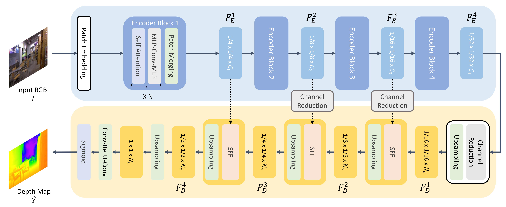
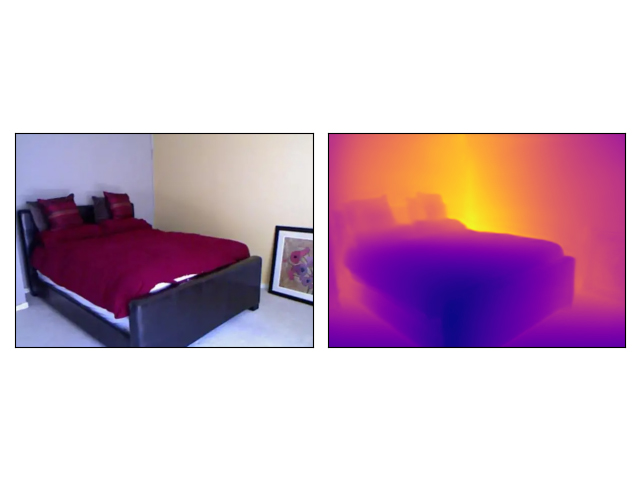
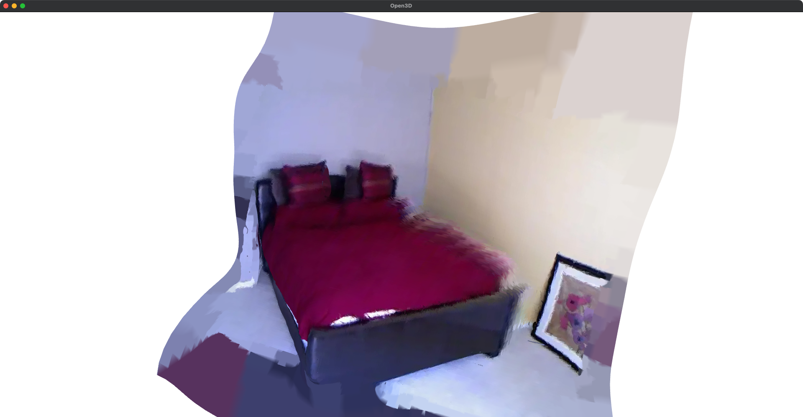

# Generate 3D Meshes from a Single Image

## Resources
* [NYU Depth Dataset V2](https://cs.nyu.edu/~silberman/datasets/nyu_depth_v2.html)
* [Feature extraction & Depth estimatimation model: vinvino02/glpn-nyu](https://huggingface.co/vinvino02/glpn-nyu)
* [MeshLab](https://www.meshlab.net/)
* [Open3D official documentation](http://www.open3d.org/docs/release/)

## GLPN fine-tuned on NYUv2

## Procedure
1. Depth estimation— the depth map of the input image is generated using a monocular depth estimation model.
2. Point cloud construction — the depth map is converted into a point cloud.
3. Mesh generation—from the point cloud, a mesh is generated by using a surface reconstruction algorithm.

## Example

### bedroom depth-map

### bedroom mesh

